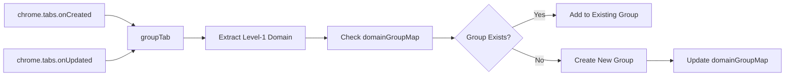
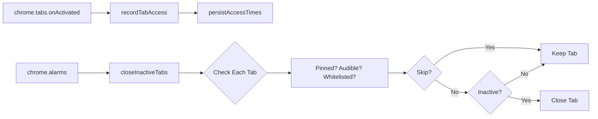
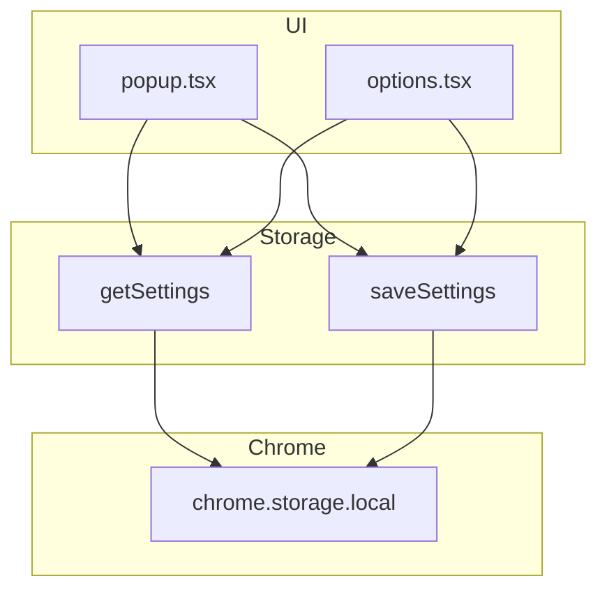
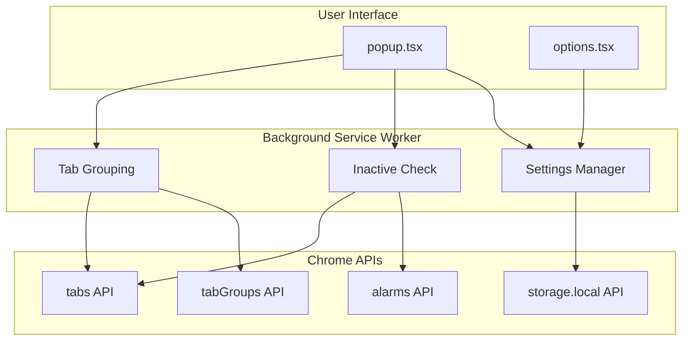

# Tab Manager Technical Architecture

## Overview

Tab Manager is a Chrome extension built with the Plasmo framework using Manifest V3. It provides automatic tab grouping by domain and automatic closure of inactive tabs.

## Tech Stack

| Layer | Technology |
|-------|------------|
| Framework | Plasmo 0.90.5 |
| Frontend | React 18.3 + TypeScript 5.7 |
| Storage | @plasmohq/storage + Chrome Storage API |
| Target | Chrome (Manifest V3) |

## Project Structure

```
tab-manager/
├── background.ts       # Service Worker - Core background logic
├── popup.tsx           # Popup window UI
├── options.tsx         # Settings page UI
├── src/
│   ├── types.ts        # TypeScript type definitions
│   ├── storage.ts      # Storage layer abstraction
│   └── utils.ts        # Utility functions
├── assets/             # Icons and static resources
└── build/              # Build output directory
```

## Core Modules

### 1. Background Service Worker (`background.ts`)

The extension's core engine handles:

#### Automatic Tab Grouping



- Uses `domainGroupMap` (in-memory cache) to map domains to group IDs
- Tabs with the same domain are grouped together
- Group color is generated based on domain hash

#### Inactive Tab Closure



- Uses Chrome Alarms API for periodic checks
- Records last access time to `chrome.storage.local`
- Skips pinned tabs, tabs playing audio, and whitelisted domains

#### Event Listeners

| Event | Handler Logic |
|-------|---------------|
| `onInstalled` | Load existing groups, initialize alarm, group existing tabs |
| `onStartup` | Load existing groups, initialize alarm |
| `tabs.onCreated` | Auto-group new tab |
| `tabs.onUpdated` | Re-group on URL change |
| `tabs.onActivated` | Record access time |
| `tabs.onRemoved` | Clean up access records |
| `alarms.onAlarm` | Trigger inactive check |

### 2. Popup Interface (`popup.tsx`)

Quick access dashboard:

- **Status Display**: Current tab count, group count
- **Feature Toggles**: Auto-group, auto-close
- **Quick Actions**:
  - Group all tabs now
  - Close inactive tabs now
- **Settings Entry**: Open options page

### 3. Options Page (`options.tsx`)

Full configuration interface:

| Setting | Description |
|---------|-------------|
| Auto-group by domain | Enable/disable automatic grouping |
| Auto-close inactive tabs | Enable/disable automatic closure |
| Inactive threshold | Minutes before closing (default: 60) |
| Check interval | How often to check (default: 5 min) |
| Whitelisted domains | Protected domains (never auto-close) |

### 4. Storage Layer (`src/storage.ts`)

Wraps `@plasmohq/storage` for unified config access:



### 5. Type Definitions (`src/types.ts`)

```typescript
interface Settings {
  autoGroupEnabled: boolean
  autoCloseEnabled: boolean
  inactiveMinutes: number
  checkIntervalMinutes: number
  whitelistedDomains: string[]
}

interface TabData {
  tabs: Record<tabId, { lastAccessed: timestamp }>
}
```

### 6. Utility Functions (`src/utils.ts`)

- `getLevel1Domain(url)`: Extract level-1 domain (e.g., `github.com`, `google.co.uk`)
- `getGroupColor(domain)`: Generate group color based on domain hash

## Data Flow



## Permissions

```json
{
  "permissions": [
    "tabs",        // Tab read/write access
    "tabGroups",   // Tab group management
    "storage",     // Data persistence
    "alarms"       // Scheduled tasks
  ]
}
```

## Build & Deploy

### Development

```bash
npm run dev    # Start dev server
# Output: build/chrome-mv3-dev/
```

### Production

```bash
npm run build  # Production build
# Output: build/chrome-mv3-prod/
```

### CI/CD

Uses GitHub Actions (`bpp`) for automated Chrome Web Store submission.

## Design Decisions

### 1. Memory Cache vs Persistence

| Data | Storage | Reason |
|------|---------|--------|
| `domainGroupMap` | In-memory Map | Rebuilt via `loadExistingGroups()` on restart |
| `tabData` | `storage.local` | Persisted to survive browser restarts |

### 2. Domain Grouping Strategy

Uses Level-1 domain (not full hostname) for grouping:

| URL | Group Domain |
|-----|--------------|
| `mail.google.com` | `google.com` |
| `github.com` | `github.com` |
| `example.co.uk` | `example.co.uk` |

Handles two-part TLDs (co.uk, com.au, etc.)

### 3. Whitelist Mechanism

Whitelisted domains are never auto-closed. Use cases:

- Frequently used tools (Google, GitHub)
- Long-running background tasks
- Important work pages

## Extensibility

### Adding New Features

1. Add type definitions in `src/types.ts`
2. Add storage logic in `src/storage.ts`
3. Add background handling in `background.ts`
4. Add UI in `popup.tsx` / `options.tsx`

### Adding New Permissions

1. Update `package.json` → `manifest.permissions`
2. Use new API in `background.ts`
3. Rebuild extension